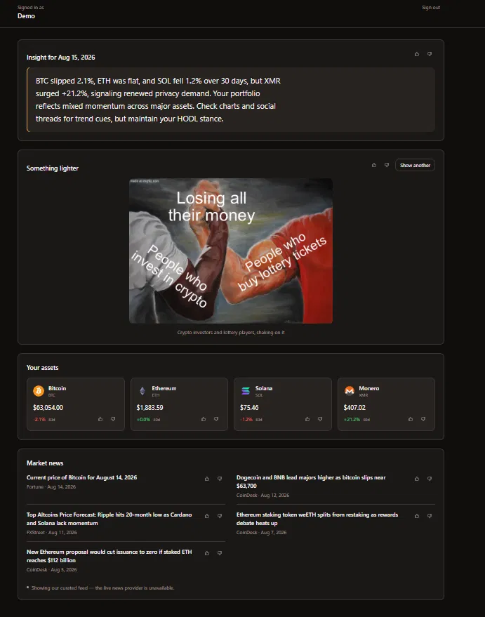
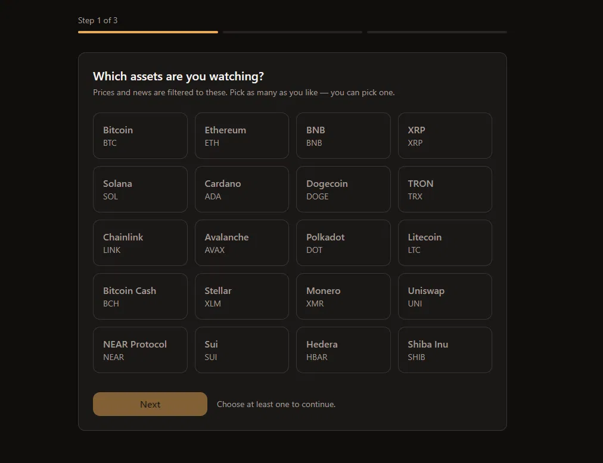

# Crypto Advisor Dashboard

A personalised crypto dashboard. Register, answer three questions — which assets you follow,
what kind of investor you are, what you want to see first — and the dashboard is built from the
answers: live prices for your watchlist read through the time window your investor type implies,
market news filtered to your assets, an AI insight generated once a day from your watchlist and
recent prices, and a meme. Sections are ordered by your preferences, and every item on the page
can be voted up or down — and because the day's insight is already written by the time you vote
on it, those votes shape the following day's insight rather than today's.

**Live:** https://ai-crypto-advisor-ivory.vercel.app

**Demo login:** `demo@cryptoadvisor.app` / `demo1234` — a shared demo account on a live
deployment, holding no real data. It already has preferences set, so the dashboard is populated
on arrival. This is a published demo login rather than a leaked credential; nothing in the
account is private.

The API runs on a free tier that sleeps after inactivity, so the first request after an idle
period takes some seconds to wake. The app pings the health endpoint as it loads to start that
early, and says so on screen if a request runs long.





## Running it locally

Node ≥20. Two applications, each with its own `package.json`, installed and run separately —
deliberately not an npm workspace, because both hosting platforms build from a subdirectory and
workspaces complicate that for no benefit here.

**API**

```
cd server
npm install
cp .env.example .env        # then fill in the values below
npx prisma migrate dev      # creates the schema
npx prisma db seed          # one demo user with preferences and a few votes
npm run dev                 # http://localhost:4000
```

`server/.env` needs a Postgres connection — two URLs pointing at the same database, one pooled
for the application and one direct, which Prisma Migrate requires — a `JWT_SECRET` of at least
32 characters, `CORS_ORIGINS=http://localhost:5173`, a CoinGecko demo key and an OpenRouter key
and model. `server/.env.example` lists every variable with a comment. The API validates its
environment at boot and refuses to start if a required value is missing or malformed, so a
misconfiguration is a crash on startup rather than a broken feature discovered later.

The seed creates an account, `demo@example.com` / `demo-password-1234`, **in your local
development database only.** It is a convenience for working on the app offline and does not
exist on the deployment — which is exactly why the seed refuses to run when `NODE_ENV=production`:
its password is written in this repository, and one careless run against a live database would
turn that into a real account with public credentials.

**Web**

```
cd client
npm install
cp .env.example .env        # VITE_API_BASE_URL=http://localhost:4000/api
npm run dev                 # http://localhost:5173
```

`client/.env` is gitignored and a fresh clone will not reach the API without it. In production
that variable is deliberately unset: the two applications are served from one origin, so the
default `/api` is correct there and nothing needs configuring on the hosting dashboard.

## Architecture

```
        Browser
           │   only ever talks to one origin
           ▼
  Vercel ─── SPA — React 18, TypeScript, Vite, Tailwind, TanStack Query
     │
     │   rewrite: /api/* and /healthz forwarded server-side
     ▼
  Render ─── API — Express 5, TypeScript, Prisma ──────► Neon — PostgreSQL
                     │
                     ├──► CoinGecko    prices, cached per coin
                     ├──► OpenRouter   the daily insight
                     └──► CryptoPanic  news — unauthenticated, so a curated feed serves instead
```

The rewrite is load-bearing rather than cosmetic. Because the static host forwards `/api/*` to
the API, the browser never makes a cross-origin request, so the session cookie is first-party
and `SameSite=Lax` — which is what keeps it working in browsers that block third-party cookies.

Inside the API, every request goes through the same four layers: **routes → controller → service
→ repository/provider.** Routes are the HTTP shape and nothing else, controllers translate
between HTTP and the domain, services hold the logic and know nothing about `req`/`res`, and
repositories and providers are the only things that touch Prisma or make outbound calls. The
design record, including the reasoning behind each decision and everywhere reality diverged from
it, is in [`docs/ARCHITECTURE.md`](docs/ARCHITECTURE.md).

## Decisions and trade-offs

**The session is a JWT in an httpOnly cookie, not in `localStorage`.** A token in `localStorage`
is readable by any script on the page, including one arriving through a compromised dependency,
so a single XSS becomes a stolen session. The browser holds this one and JavaScript never sees
it. The cost is CSRF, which `localStorage` does not have. `SameSite=Lax` blocks the cross-site
form-post vector, which is the common one, but it does not close CSRF by itself — a double-submit
token is the next addition. The exposure today is small rather than absent: every endpoint that
changes data requires the cookie and is a POST or a PUT, and the only GET with a side effect
writes the day's insight, which the user's own dashboard would have written anyway. The second
cost is plainer: a JWT cannot be revoked before it expires, so logout clears the cookie but a
captured token stays valid for its lifetime.

**Four separate endpoints for the four dashboard sections, not one aggregate.** They have
genuinely different cache lifetimes — two minutes, ten minutes, a day, none — and one endpoint
would collapse to the shortest. They also fail independently: when the AI service is rate
limited, prices still render. The cost is four round trips instead of one, issued in parallel, so
the added latency is roughly one round trip rather than four.

**The insight is generated once per user per UTC day and stored.** The free AI tier allows
roughly fifty requests a day across the whole account, so generating on every page load would
exhaust it in a handful of refreshes. It is also simply correct: an "insight of the day" should
not change when you hit refresh. The cost is that a bad day is a whole day — if the AI service is
unreachable at the moment your first request lands, the template written in its place is what you
see until tomorrow.

**Prices are cached per coin, not per user.** The obvious design keys the cache by the requesting
user's watchlist, which makes upstream traffic scale with the number of distinct watchlists — so
with the number of users. Instead one batched request fetches the whole curated list and stores
each coin under its own key, and any user's dashboard is assembled from shared entries. Upstream
volume scales with the number of coins, and adding a user costs nothing.

**Sections are reordered by preference, never hidden.** Someone who only picked "fun" still gets
prices and news, below and visually quieter. Hiding would make personalisation more dramatic and
the product worse, since all four sections are meant to work for everyone. One deliberate
exception: the AI insight is never pushed to the bottom of the page regardless of ranking,
because it is the one thing here this project produces rather than fetches.

**One hand-written SQL query in an otherwise ORM project.** The feedback aggregation is a `JOIN`
and a `GROUP BY` across several dimensions, which reads better as SQL than as an ORM call, so it
is written by hand with bound parameters. Everything else goes through Prisma, which generates
the schema and the types from one file and parameterises every query. The cost is one query that
type checking cannot verify against the database — so it is the one place where a schema change
would need a human to notice.

**The curated news feed is the production path, not a fallback that never runs.** No token was
obtained for the live news provider, and unauthenticated it returns 404, so the service falls
back to a curated set of articles on every request. That is stated on screen rather than hidden.
The provider interface has two real implementations, which means the vendor is genuinely a
configuration choice and the fallback path is exercised continuously instead of being untested
branch coverage — but it also means the live integration is written from documentation and has
never seen an authenticated response.

**Feedback closes a loop rather than accumulating.** Votes are summarised into the prompt that
writes the next insight, so a stored vote demonstrably changes what the model is asked, and the
prompt version is stored on every row so insights stay attributable to the prompt that produced
them. The signal is coarser than it looks, though: a downvote on an article means one thing,
while a downvote on a coin is ambiguous — the watchlist already says which coins you want, so
it could mean the coin, the section, or the price itself.

## Known limitations

- **The API sleeps after inactivity** and takes some seconds to wake. The app pings the health
  endpoint on load so waking overlaps with reading the login form, and surfaces a message when a
  request runs long.
- **Free-tier caps shape several designs**: roughly 333 market-data calls a day, and roughly 50
  AI requests a day across the whole account. The cache lifetimes and the once-a-day insight
  follow from those numbers.
- **The news section is permanently degraded by design** and says so on every visit. The live
  provider needs a token this project does not have — unauthenticated it returns 404, not 401 —
  so seven curated articles, captured on 2026-08-15, are what the section serves.
- **Feedback reaches the next day's insight, not today's.** Today's is already written and stored
  by the time you vote on it.
- **Preferences cannot be changed after onboarding.** The wizard is the only preferences
  interface, and it is not reachable once completed. The data is editable through the API; what is
  missing is a screen.
- **Desktop layout only.** It holds down to about 1024 pixels wide and there is no mobile layout.
- **The dashboard's first paint uses a default section order** and reorders when preferences
  arrive, a fraction of a second later. Blocking the page on that request would mean an empty
  screen for as long as the API takes to wake.

## With more time

**Tests first, and specifically:** password hashing and comparison, JWT signing and verification
including expiry, the auth middleware rejecting both missing and invalid cookies, cache TTL
expiry, preferences validation rejecting a bad enum, and one integration test running register →
login → session through the HTTP layer. Those are the security-critical and silently-breakable
paths; broad coverage of trivial code would demonstrate less.

**A preferences screen**, reusing the onboarding steps against the existing endpoint — the
largest functional gap in the product today.

**A mobile layout**, which the dashboard's section-per-card structure should take without a
rewrite.

**An index for cross-user feedback aggregation.** The current indexes serve per-user queries,
which is all anything asks for today; a query grouping votes by item across users would need
another one, and adding it later is an online, non-breaking change.

## Read-only database access

Read-only database access is available on request: a `reviewer` role scoped to `SELECT` on the
public schema, with no write privileges. Credentials supplied separately and never committed.
